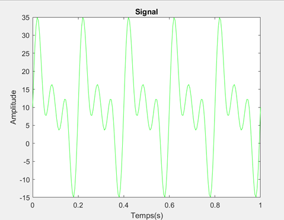
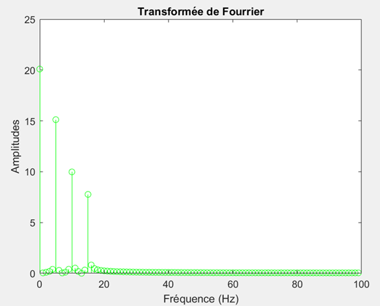
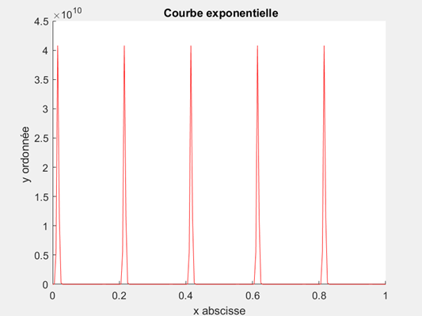
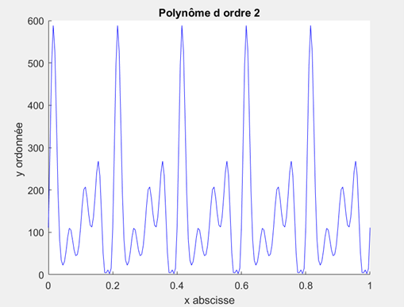
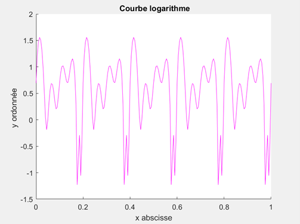

# Realization of an HMI
## Objective of the project
The objective of this project is to develop a human-machine interface qui pourra : 
* Simulate a harmonic signal
* Impose different errors on the simulated signal
* Be able to correct them

## Programming language
* MATLAB

## Simulation
I created a first function which allows to have a temporal harmonic signal.  
Subsequently, I created a second function with the sampling frequency to obtain the Fourier transform.   
Here is the error free signal graph: 

  

Here is the graph of the error-free Fourier transform : 

  

## Application of errors
### Linear error
For a linear error, we apply the gain and offset error.     
I applied to my basic signal a linear error.  

  

### Non-linearity error
For this part, I applied to my signal a nonlinear function. For this, I chose 3 linear functions:
* Exponential: applied to the time vector and the basic signal  

  

* Polynomial of order 2: applied to the time vector and to the basic signal y

  

* Logarithmic: applied to x and the base signal

  

Here is the HMI with a non-linearity error, case of polynomial of order 2:

  

## Conclusion
The project objective is to program a Human-Machine interface, which included a signal as well as a Fourier transform to which we were able to add different types of errors.
