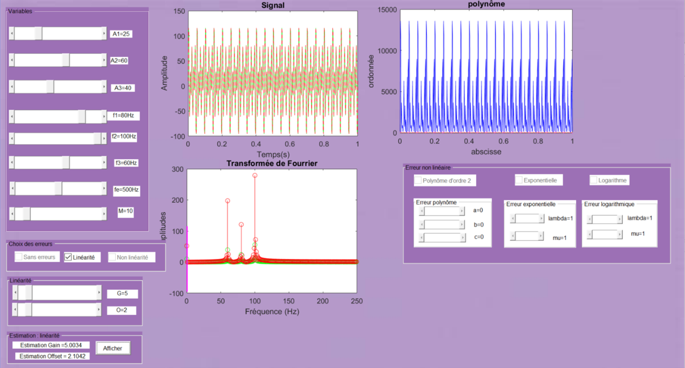
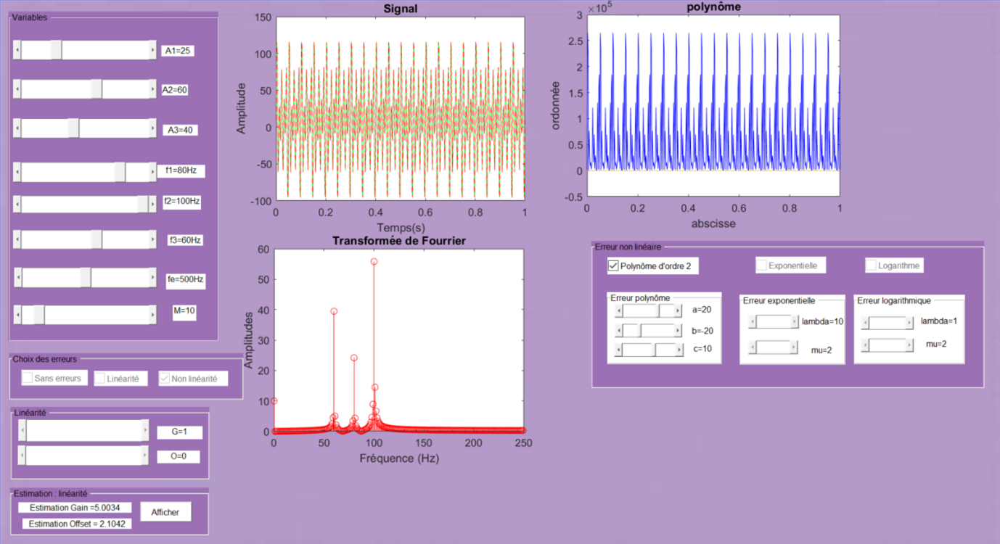

# Realization of an HMI
## Objective of the project
The objective of this project is to develop a human-machine interface qui pourra : 
* Simulate a harmonic signal
* Impose different errors on the simulated signal
* Be able to correct them

## Programming language
* MATLAB

## Simulation
I created a first function which allows to have a temporal harmonic signal.  
Subsequently, I created a second function with the sampling frequency to obtain the Fourier transform. On this Fourier transform, I applied the gain and the offset.

Here is the HMI with a linearity error:

  

Here is the HMI with a non-linearity error, case of polynomial of order 2:

  

